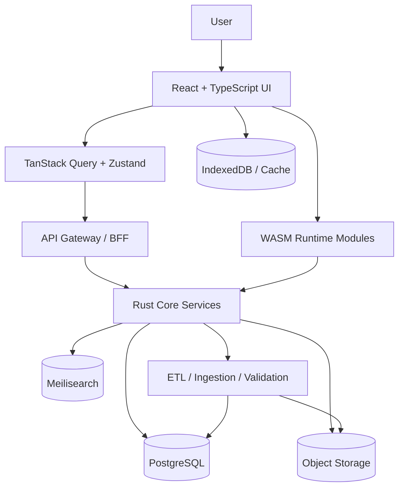
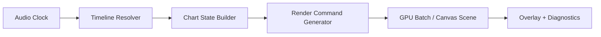

# Arcaea-Viewer Master Plan

## 1. Executive Summary

Arcaea-Viewer is a research-grade, offline-capable, interactive platform for exploring Arcaea charts, gameplay metadata, replays, progression paths, and lore-connected content. It is not a static wiki and not a one-off fan tool. It is a data system, visualization engine, and analysis platform designed to scale from a single-user browser session to a long-lived, maintainable, multi-surface product with strong correctness guarantees.

The technical philosophy is to separate concerns aggressively:

- Presentation is owned by React and TypeScript.
- Data orchestration is owned by TanStack Query, local caches, and a disciplined API layer.
- High-performance and deterministic logic is owned by Rust.
- Browser acceleration is delivered through WASM.
- Rendering is isolated behind a dedicated visualization subsystem.
- Offline behavior is a first-class requirement, not a later enhancement.
- Security, legal compliance, and data provenance are treated as product constraints, not documentation afterthoughts.

The long-term goal is to create a platform that can answer practical and research-oriented questions about Arcaea content and play patterns with high confidence:

- What is the structure of a chart and how does it evolve over time?
- How do replay inputs align to note windows and timing offsets?
- Which patterns dominate a specific difficulty band?
- Where are player bottlenecks, stamina spikes, and reading stress points?
- How can the app function in a degraded offline environment with partial synchronization?

Arcaea is a strong fit for this kind of platform because it combines tightly structured chart data, visually rich note and arc mechanics, replay-relevant timing behavior, and lore/progression systems that benefit from cross-linked exploration. The game’s mechanics are rich enough to justify a real engine, but still bounded enough to support deterministic modeling, search, and analytics without requiring an open-ended simulation layer.

Compared with Sekai Viewer-style products, Arcaea-Viewer should be more analysis-driven, more offline-oriented, and more explicit about runtime correctness. Sekai Viewer is a useful inspiration for database presentation and chart browsing, but Arcaea-Viewer should go further in replay analysis, performance modeling, deterministic playback, local caching, and Rust/WASM-based runtime isolation.

## 2. Core Product Goals

### 2.1 Interactive Database

The database layer should support deep exploration of songs, charts, difficulties, side content, story/lore entities, and progression artifacts. Users should be able to:

- search by song title, alias, chart characteristics, note density, BPM range, version, artist, and content tags;
- filter by difficulty, chart type, release era, and mechanical features;
- cross-link charts with characters, packs, story chapters, and progression unlocks;
- inspect structured metadata and provenance for each record;
- compare related versions of the same chart or asset.

The UI should feel like an investigative tool rather than a gallery. The system should privilege structured navigation, faceted search, and direct links between entities.

### 2.2 Chart Rendering

Arcaea charts must be rendered in a way that is visually faithful, performant, and debuggable. The renderer should support:

- note lanes and timing lines;
- taps, holds, arcs, flicks, and special note interactions as supported by the data model;
- synchronized playback with timeline scrubbing;
- adjustable speed and calibration offsets;
- debug overlays for timing windows, beat grid, note classifications, and replay markers.

Rendering is not a cosmetic layer. It is the primary validation surface for parser correctness and replay synchronization.

### 2.3 Analytics

The analytics subsystem should quantify chart difficulty, pattern composition, reading load, stamina stress, and timing complexity. It should provide:

- note density over time;
- burst and sustain segmentation;
- arc complexity metrics;
- hand alternation and cross-hand risk estimates;
- difficulty heuristics and version comparisons;
- candidate features for later ML-assisted scoring.

Analytics must remain explainable. Any automated estimate should be accompanied by the feature evidence that produced it.

### 2.4 Replay System

The replay system should enable deterministic reconstruction of player input against chart timelines. It should support:

- replay ingestion and normalization;
- timestamp alignment and input window evaluation;
- ghost playback for comparison;
- per-note hit/miss analysis;
- comparison against benchmark trajectories or previous runs;
- exportable replay diagnostics for research use.

The replay engine should be deterministic by design so that identical inputs, chart definitions, and timing offsets always produce identical results.

### 2.5 Offline Mode

Offline mode should not be an afterthought. The application should function in a limited but useful state without network access:

- local chart metadata cache;
- local asset cache for images, charts, and derived data;
- IndexedDB-backed query and asset persistence;
- PWA installation support;
- synchronization reconciliation when connectivity returns.

Offline mode should degrade gracefully, not fail catastrophically.

### 2.6 Progression Tools

The platform should help users understand progression and planning questions:

- which songs or charts are suitable prerequisites for a target difficulty;
- how player skill requirements compare across chart families;
- where a progression path should introduce arc reading, burst timing, or stamina pressure;
- what goals a user can reach in a given time horizon.

This layer can begin as structured recommendation logic and later evolve into a more sophisticated model.

### 2.7 Lore Explorer

Arcaea-Viewer should connect gameplay content to story and lore entities. The lore system should provide:

- chronological browsing of story materials;
- character and chapter relationship graphs;
- version- and pack-based context;
- cross-links between narrative content and gameplay unlocks.

This is a content graph, not just a text page system.

## 3. System Architecture

### 3.1 Architecture Philosophy

The platform should use a layered architecture with explicit boundaries:

- UI and interaction state in React.
- Data access and caching in a thin client orchestration layer.
- Deterministic chart, timing, and replay logic in Rust.
- Browser acceleration through WASM for selected hot paths.
- Backend services for canonical data, synchronization, search, and privileged operations.
- Local persistence for offline and low-latency reads.

The system should prefer stable internal contracts over direct cross-layer coupling. A parser should not depend on UI assumptions, and UI code should not encode chart semantics directly.

### 3.2 High-Level Diagram



### 3.3 Runtime Layers

The runtime should be organized into these layers:

- Presentation: routes, pages, components, layouts, design primitives.
- Client orchestration: query keys, cache invalidation, offline hydration, optimistic UI.
- Domain services: chart metadata, search, progression, replay lookup, user settings.
- Core logic: parsers, timing, scoring, replay simulation, analytics.
- Infrastructure: storage, object access, search index, auth, logging, observability.

### 3.4 Service Boundaries

Keep the service boundaries narrow and well-defined:

- Metadata service: canonical song, chart, pack, story, and asset records.
- Chart service: parsed chart definitions, timing data, and derived chart features.
- Replay service: replay ingestion, normalization, comparison, and storage.
- Analytics service: chart metrics and computed insights.
- Search service: text, facets, and ranking.
- Asset service: downloads, normalization, checksums, and cache manifests.

### 3.5 Frontend/Backend Separation

The frontend should never directly depend on privileged storage or file-system operations. Any access to durable canonical data should flow through an API or a local cache abstraction that mimics the same contract. This keeps the browser runtime portable and allows desktop or PWA packaging later without rewriting business logic.

### 3.6 WASM Integration

WASM should be used selectively where Rust provides a clear benefit:

- parsing and validating chart data;
- timing window calculations;
- replay simulation and note-hit evaluation;
- derived analytics functions with high iteration counts;
- any logic that benefits from deterministic execution and shared code across web and backend.

Do not move everything into WASM. Keep the surface small and use stable JSON or binary contracts. Use WASM for compute, not for general app state.

## 4. Monorepo Structure

The repository should use a monorepo layout with strict responsibility boundaries.

```txt
apps/
  web/
  admin/
  worker/
  desktop/
crates/
  core/
  parser/
  replay/
  analytics/
  timing/
  wasm/
  api/
  ingest/
  common/
packages/
  ui/
  design-tokens/
  config/
  api-client/
  types/
  test-utils/
tools/
  scripts/
  codegen/
  validation/
  benchmark/
data/
  raw/
  normalized/
  snapshots/
  fixtures/
docs/
  architecture/
  rfc/
  api/
  runbooks/
infra/
  docker/
  k8s/
  cloudflare/
  ci/
  terraform/
```

### 4.1 `apps/`

Runtime entry points and deployable surfaces.

- `web`: primary browser app.
- `admin`: internal operations and moderation tooling.
- `worker`: asynchronous jobs such as indexing and asset processing.
- `desktop`: optional desktop shell for later packaging.

### 4.2 `crates/`

Rust workspace crates for the core engine.

- `core`: shared domain primitives.
- `parser`: chart parsing and validation.
- `replay`: deterministic replay simulation.
- `analytics`: chart metric generation.
- `timing`: beat map, offsets, windows, and sync math.
- `wasm`: browser-facing bindings.
- `api`: backend service implementation.
- `ingest`: ETL and source normalization.
- `common`: shared Rust utilities and types.

### 4.3 `packages/`

Shared TypeScript packages.

- `ui`: reusable UI primitives and app components.
- `design-tokens`: colors, spacing, typography, motion tokens.
- `config`: lint, TS, formatting, and app config presets.
- `api-client`: typed client for the backend.
- `types`: generated and shared domain types.
- `test-utils`: fixtures and helpers.

### 4.4 `tools/`

Automation and support scripts.

- code generation;
- schema validation;
- data sanity checks;
- benchmark harnesses;
- release helpers.

### 4.5 `data/`

Versioned raw and processed data.

- `raw`: ingested source material.
- `normalized`: validated, deduplicated, versioned records.
- `snapshots`: reproducible datasets for tests.
- `fixtures`: minimal test inputs.

### 4.6 `docs/`

Architecture, RFCs, API docs, and runbooks. This should remain the canonical place for decisions, tradeoffs, and operational procedures.

### 4.7 `infra/`

Infrastructure as code, deployment manifests, CDN configuration, and CI definitions.

## 5. Frontend Architecture

### 5.1 React Architecture

Use React with feature-oriented boundaries, not component spaghetti. Organize the frontend by domain surfaces such as chart explorer, replay viewer, analytics, lore browser, search, and settings. Each surface should own its route tree, query hooks, view models, and local UI state.

Avoid over-centralized global state. Use global state only for truly cross-cutting concerns such as auth session, theme, user preferences, offline status, and persistent playback settings.

### 5.2 State Management

Recommended state stack:

- Zustand for local app state that needs predictable, lightweight persistence.
- TanStack Query for server state, cache hydration, background refetching, and invalidation.
- Derived selectors and memoized view models for computed display state.
- URL state for shareable filters, search terms, and route identity.

Do not store server truth in Zustand if TanStack Query can own it. Use Zustand for user preferences, editor-like local controls, and transient overlay state.

### 5.3 Rendering Pipeline

The frontend rendering pipeline should be explicit:

1. route resolves entity and view mode;
2. TanStack Query fetches canonical data and local cache state;
3. a domain view model normalizes rendering inputs;
4. the chart renderer receives immutable frame state;
5. overlays and diagnostics render on top of the base scene.

Separate data loading from visual playback. This reduces jank and improves testability.

### 5.4 Route Organization

Suggested route groups:

- `/explore`: search and browse.
- `/charts/:songId/:difficultyId`: chart detail and visualization.
- `/replays/:replayId`: replay viewer and comparison.
- `/analytics/:chartId`: chart metrics and derived analysis.
- `/lore`: narrative graph and chronology.
- `/progression`: planning tools.
- `/settings`: local preferences, cache, and sync.

### 5.5 Data-Fetching Strategy

Use a layered fetching strategy:

- initial data from API when online;
- local snapshot hydration from IndexedDB or persisted query cache;
- background refresh for stale records;
- explicit invalidation after sync or ingest updates;
- progressive disclosure for heavy entities.

Fetch the smallest stable entity first, then expand with secondary queries. Avoid loading large related graphs on the first paint unless the route explicitly requires it.

### 5.6 Cache System

The cache system should include:

- HTTP cache headers for static assets and public metadata;
- TanStack Query cache for live UI state;
- IndexedDB for durable offline records and search hints;
- local object cache for images, charts, and derived visual assets.

Persist a versioned cache manifest so invalidation is deterministic. Do not rely solely on time-based expiration for critical assets.

### 5.7 Offline Support

Offline support should be designed around predictable user value:

- browse already-synced charts;
- open cached chart pages and replay sessions;
- search over local indexed records;
- queue non-destructive local preferences;
- show clear sync state and freshness markers.

If an entity is unavailable offline, the UI should say why and what will be restored once connectivity returns.

### 5.8 Accessibility

Accessibility should be treated as part of correctness:

- keyboard-first browsing for lists, filters, timelines, and playback controls;
- explicit focus management in modal and drawer flows;
- contrast-safe visual overlays;
- reduced-motion support for chart playback and transitions;
- readable timing markers and screen-reader friendly labels for non-visual summaries.

### 5.9 Performance Optimization

Frontend performance priorities:

- route-level code splitting;
- virtualization for large tables and result lists;
- deferred rendering for heavy analytics graphs;
- canvas or WebGL isolation for chart playback;
- minimal re-render surfaces through stable props and selectors;
- prefetching only for likely next entities, not entire datasets.

## 6. Rust Core Runtime

### 6.1 Chart Parser

The chart parser should convert raw chart sources into a canonical intermediate representation with strict validation. It should:

- validate structure, ordering, ranges, and required fields;
- normalize timing and event semantics;
- emit machine-readable diagnostics and warnings;
- preserve source provenance for debugging.

Parser output should be immutable and versioned. Any derived data should be generated from the canonical intermediate form rather than re-parsing raw sources repeatedly.

### 6.2 Replay Engine

The replay engine should simulate chart playback against a stream of user actions or recorded input frames. It should support:

- input event decoding;
- note window evaluation;
- deterministic scoring logic;
- per-event classification and hit state assignment;
- replay scrubbing and partial re-evaluation.

The replay engine must be deterministic across platforms. Avoid floating-point drift where fixed-point or quantized time math is sufficient.

### 6.3 Timing Engine

The timing engine is one of the most critical subsystems. It should own:

- beat and measure conversion;
- offset handling;
- tempo segment interpretation;
- timing window calculations;
- synchronization between audio time, chart time, and UI time.

This engine should have exhaustive tests around edge cases such as tempo changes, offset adjustments, rounding thresholds, and pause/resume transitions.

### 6.4 Analytics Engine

The analytics engine should expose pure functions that compute chart features from the canonical chart representation:

- density curves;
- burst segmentation;
- stamina estimates;
- arc complexity;
- hand alternation pressure;
- late/early hazard zones;
- difficulty feature vectors.

Keep the feature schema stable so downstream consumers can compare charts over time.

### 6.5 WASM Bindings

WASM bindings should be thin and explicit.

- Prefer a small set of exported entry points over many ad hoc functions.
- Use serialization boundaries that are easy to inspect and version.
- Keep ownership clear between JS and Rust.
- Avoid high-frequency crossing of the JS/WASM boundary during frame playback.

The browser should pass compact inputs into WASM, then consume derived outputs in batches.

### 6.6 Serialization Formats

Use serialization formats according to use case:

- JSON for human-readable API payloads and debugging.
- MessagePack or a similar compact format for local caches and internal transfer where appropriate.
- Stable binary formats for replay snapshots and performance-sensitive artifacts.

Every persisted format should include versioning and backward-compatibility strategy.

### 6.7 Memory Safety

Rust provides memory safety, but the system still needs disciplined API design:

- avoid excessive cloning of large chart structures;
- use borrowing and arena-backed structures where appropriate;
- prevent lifetime complexity from leaking into public APIs;
- define clear ownership for parsed assets, caches, and replay buffers.

### 6.8 Concurrency Model

The concurrency model should favor task isolation over shared mutable state:

- async for I/O-bound fetch and ingest workloads;
- bounded worker pools for ETL and indexing;
- pure data transforms for parser and analytics logic;
- message passing or job queues for long-running background tasks.

Do not build a tangled shared-state system around locks unless the contention profile is measured and justified.

## 7. Chart Visualization System

### 7.1 Visual Model

The visualization system should model charts as layered time-synchronized scenes:

- base lane geometry;
- timing grid and marker layers;
- interactive notes and arcs;
- background and atmosphere layers;
- diagnostic overlays;
- replay ghost layer.

### 7.2 Arc Rendering

Arc rendering should prioritize fidelity and clarity:

- maintain smooth interpolation between control points;
- support line thickness and highlight behavior without aliasing artifacts;
- differentiate active, pending, and evaluated arcs;
- keep path evaluation deterministic with the parser’s canonical timing.

### 7.3 Note Objects

Notes should be rendered as typed objects with metadata-driven behavior:

- tap notes with hit windows and visual states;
- hold notes with start, sustain, and release markers;
- arc-linked events with position synchronization;
- special notes with explicit styling and tooltip semantics.

### 7.4 Animation System

The animation system should use a frame-driven model:

- derive frame state from chart time, not from incremental UI mutation;
- use interpolation only for display effects, not for core logic;
- keep animation easing separate from replay evaluation;
- honor reduced-motion settings.

### 7.5 Timeline Synchronization

Synchronization should be based on a single authoritative timeline abstraction. UI scrubber state, audio playback, note animation, and replay evaluation must read from the same canonical time source with explicit offset rules.

### 7.6 Replay Playback

Replay playback should be implemented as a render mode, not as a separate rendering pipeline. The same chart scene should be able to render:

- live chart preview;
- ghost replay comparison;
- hit result overlays;
- debugging and timing diagnostics.

### 7.7 Frame Pipeline



### 7.8 Rendering Architecture

A practical split is:

- Rust/WASM handles canonical time, chart evaluation, and replay state;
- React manages surrounding UI and controls;
- PixiJS or Three.js/WebGPU handles the visual scene;
- overlays and labels remain in React or a lightweight DOM layer when accessibility matters.

### 7.9 Optimization Strategies

- batch static geometry;
- reuse buffers for repeated note objects;
- minimize per-frame allocations;
- precompute immutable path segments;
- cull off-screen objects;
- avoid expensive text layout in the hot path;
- keep debug overlays opt-in.

## 8. Data Pipeline

### 8.1 Metadata Extraction

The data pipeline should ingest authoritative and community-maintained sources carefully, preserving provenance. Extraction should identify:

- song metadata;
- chart difficulty and version;
- artist and asset references;
- release and pack relations;
- story or lore linkages;
- derived metrics and normalized aliases.

### 8.2 Asset Normalization

Normalize all assets into deterministic, versioned representations:

- image resizing and format conversion;
- checksum generation;
- content-addressed caching where appropriate;
- metadata sidecars for provenance and version.

### 8.3 ETL Pipeline

The ETL pipeline should be reproducible:

1. ingest raw source snapshots;
2. validate schema and completeness;
3. normalize and enrich records;
4. generate derived views and search documents;
5. publish to object storage, search, and databases.

### 8.4 Schema Validation

Every source should be validated against an explicit schema and rule set. Validation should fail loudly for malformed or inconsistent structures, but should also preserve partial successes when safe.

### 8.5 Versioning

Versioning must be per dataset and per derived artifact. The system should track:

- source version;
- normalization version;
- analytics version;
- schema version;
- client compatibility version.

### 8.6 Update Strategy

Use incremental updates for normal operation and full snapshots for integrity checks. Critical derived data should be rebuildable from raw inputs and versioned transformation code.

### 8.7 Caching

Use multiple caches with clear responsibilities:

- object cache for assets;
- query cache for app responses;
- local search cache for offline browsing;
- derived metrics cache for expensive analytics.

## 9. Database Design

### 9.1 PostgreSQL Schema Concepts

PostgreSQL should store canonical relational entities:

- songs;
- charts;
- packs;
- story entries;
- asset references;
- replay metadata;
- analytics snapshots;
- provenance records.

### 9.2 Schema Principles

- normalize stable entities;
- denormalize only when query patterns justify it;
- keep provenance and version metadata adjacent to canonical entities;
- design for append-only derived records where possible.

### 9.3 Indexing

Index for the actual query workload:

- text search indexes for titles, aliases, and story names;
- composite indexes for difficulty and version filters;
- covering indexes for common browse pages;
- partial indexes for active or public records;
- foreign key indexes for graph traversal.

### 9.4 Search Strategy

Use Meilisearch for interactive search and PostgreSQL for authoritative relational queries. Search documents should be generated from the canonical database and versioned alongside source data.

### 9.5 Local Cache Strategy

Local cache should use SQLite for structured offline storage and IndexedDB for browser persistence. The client should persist:

- recently viewed entities;
- searchable metadata subset;
- cached query results;
- replay state snapshots;
- small derived analytics payloads.

### 9.6 Synchronization Model

The sync model should be explicit:

- remote canonical source is authoritative;
- local cache is a read-optimized replica of selected data;
- sync jobs reconcile by version and checksum;
- stale data is marked, not silently overwritten.

## 10. API Design

### 10.1 REST API

REST should be the primary public interface. Keep endpoints resource-oriented and predictable:

- `/v1/charts`
- `/v1/songs`
- `/v1/replays`
- `/v1/analytics`
- `/v1/lore`
- `/v1/search`

### 10.2 Optional GraphQL

GraphQL can be useful for internal or highly compositional views, but should not replace the primary REST contract unless query complexity grows beyond what REST can reasonably serve. If added, keep it read-only at first.

### 10.3 Pagination

Use cursor-based pagination for large datasets and stable offset-based pagination only where it is safe and predictable. Return total counts only when they are not expensive or misleading.

### 10.4 Caching

Use cache headers aggressively for immutable assets and versioned metadata. Prefer content hashes and explicit version IDs over guessing cache freshness.

### 10.5 Rate Limiting

Rate limiting should protect:

- search endpoints;
- replay upload or comparison endpoints;
- any privileged admin APIs;
- unauthenticated browsing bursts.

### 10.6 API Versioning

Version the API at the path level or via explicit version negotiation. Never break clients without a migration window and documented deprecation plan.

### 10.7 Auth Strategy

Use the lightest viable auth model for each surface:

- anonymous public browsing where safe;
- session or token auth for user-specific settings and saved content;
- privileged auth for admin or maintenance surfaces.

## 11. Replay System

### 11.1 Replay Format

Replay files should capture all data needed for deterministic evaluation:

- chart identity and version;
- input events with timestamps;
- calibration and timing offsets;
- client build or engine version;
- optional metadata for device or control mode.

### 11.2 Event Timeline

Treat the replay as a timeline of discrete inputs mapped onto chart-time evaluation windows. Preserve raw event order and normalized evaluation order separately.

### 11.3 Synchronization

Synchronization must account for:

- audio latency;
- device latency;
- calibration offsets;
- timing segment boundaries;
- pause/resume behavior.

### 11.4 Deterministic Playback

Deterministic playback requires:

- stable input ordering;
- consistent timing math;
- versioned hit window definitions;
- no hidden dependence on frame-rate timing.

### 11.5 Comparison Tools

Provide replay comparison views that show:

- current replay vs. ghost run;
- note-by-note delta in timing and accuracy;
- segment-level summary of mistakes;
- consistency comparisons across attempts.

### 11.6 Ghost System

Ghost runs should be stored as replay-derived reference tracks rather than as ad hoc UI state. This makes them reproducible and exportable.

## 12. Analytics Engine

### 12.1 Note Density Analysis

Compute density curves across time windows of different sizes to capture bursts, transitions, and sustained pressure. Expose both raw counts and normalized rates.

### 12.2 Pattern Recognition

Detect recurring structural features such as:

- alternating taps;
- chord bursts;
- sustained arcs with interruptions;
- cross-lane hand shifts;
- rhythmical ambiguity zones.

### 12.3 Stamina Analysis

Estimate stamina pressure by combining density, repetition, burst spacing, and recovery windows. The output should be a score and a reasoned breakdown.

### 12.4 Arc Complexity

Arc complexity should account for path variance, velocity changes, layered arcs, and attention load during concurrent note interactions.

### 12.5 Difficulty Estimation

Difficulty estimation should be explainable and conservative. Start with feature-based heuristics, then evaluate ML-assisted models only after the baseline is stable and validated.

### 12.6 ML Possibilities

ML can help with:

- difficulty clustering;
- pattern classification;
- anomaly detection in chart structure;
- replay behavior segmentation.

ML should augment, not obscure, the deterministic analytical baseline.

## 13. Offline-First Strategy

### 13.1 PWA

The web app should support PWA installation with carefully scoped service workers, offline shell caching, and explicit asset manifests.

### 13.2 IndexedDB

IndexedDB should hold browser-side durable state:

- cached entities;
- versioned manifests;
- local settings;
- recent search results;
- downloaded chart and image references.

### 13.3 Local Asset Cache

Store large media and chart assets in a local cache with integrity hashes and eviction policy. Avoid loading everything at once.

### 13.4 Synchronization

Sync should be explicit and resumable. The client should know:

- what is local;
- what is stale;
- what is missing;
- what has been superseded.

### 13.5 Lazy Loading

Lazy load long-tail data, expensive analytics, and high-resolution media only when the user moves into those views.

## 14. Security & Legal Considerations

This project must be careful about legality, ethics, and user safety.

### 14.1 Copyright Awareness

- Treat copyrighted assets as sensitive and version-bound.
- Prefer metadata, derived analysis, and user-provided content over redistributing protected media where rights are unclear.
- Maintain clear provenance for any stored asset.

### 14.2 No DRM Bypassing

Do not build tooling intended to circumvent DRM, access controls, or platform protections. The project should focus on legitimate metadata, analysis, and visualization workflows.

### 14.3 No Cheating Support

Do not provide cheating automation, input injection, or gameplay circumvention features. Replay analysis is for understanding and research, not abuse.

### 14.4 Asset Handling Policies

- use checksum verification;
- keep source origin documented;
- isolate processing pipelines from public serving surfaces;
- sanitize filenames and metadata before persistence.

### 14.5 Community Safety

If the project supports uploads, comments, or shared replays later, include moderation, abuse detection, and reporting workflows. Do not assume benign user behavior.

### 14.6 Backend Hardening

- validate all inputs;
- use least-privilege service accounts;
- isolate ingestion jobs from public APIs;
- enforce request size limits;
- log suspicious access patterns;
- protect internal admin endpoints.

### 14.7 Rate Limiting

Rate limit public APIs and especially expensive search, replay processing, and export endpoints.

### 14.8 Supply-Chain Security

- pin dependencies where appropriate;
- audit npm and Rust dependencies regularly;
- generate SBOMs;
- review transitive package risk;
- avoid unbounded auto-update behavior in build pipelines.

### 14.9 Dependency Auditing

Integrate periodic dependency audits into CI. Track vulnerabilities, stale packages, and license changes as operational signals rather than one-off checks.

## 15. Performance Engineering

### 15.1 Render Optimization

The visual engine must be measured on real workloads. Optimize for:

- frame stability;
- batching efficiency;
- memory reuse;
- minimal scene churn;
- low layout thrash.

### 15.2 Batching

Batch draw calls for recurring note and arc objects. Separate dynamic overlays from mostly static chart geometry so the hot path stays small.

### 15.3 Memory Management

- reuse buffers;
- avoid per-frame allocations;
- stream large assets rather than materializing everything at once;
- keep replay state compact.

### 15.4 WASM Optimization

- minimize boundary crossings;
- pass contiguous buffers;
- avoid expensive conversions in hot loops;
- benchmark compilation flags for size and speed tradeoffs.

### 15.5 Profiling Strategy

Use a layered profiling approach:

- browser performance tools for render and scripting cost;
- Rust profiling for parser and analytics hot paths;
- synthetic benchmarks for regression detection;
- real user telemetry where appropriate and privacy-safe.

### 15.6 Benchmark Infrastructure

Maintain repeatable benchmarks for:

- parser throughput;
- replay evaluation speed;
- chart rendering frame time;
- search latency;
- cache hydration performance.

## 16. DevOps & Infrastructure

### 16.1 Docker

Use Docker for consistent local and CI execution. Keep images small, reproducible, and role-specific.

### 16.2 CI/CD

The pipeline should include:

- lint and format checks;
- unit and integration tests;
- parser and replay determinism tests;
- frontend build verification;
- security scanning;
- deployment validation.

### 16.3 Testing Pipelines

Run fast checks on every commit and deeper suites on merge or release candidates. Separate quick feedback from full confidence builds.

### 16.4 Staging

Use staging to validate data sync, search indexing, cache invalidation, and replay workflows against production-like snapshots.

### 16.5 Observability

Instrument the system with:

- structured logs;
- metrics for latency, cache hit rate, and queue depth;
- traces for API and background job latency;
- error aggregation with actionable context.

### 16.6 Monitoring

Monitor:

- API availability;
- search health;
- job failures;
- cache growth;
- storage use;
- replay and parser error rates.

### 16.7 Backups

Back up canonical databases, derived indexes, and critical manifests. Make restore procedures part of the documented operational workflow, not just a checkbox.

### 16.8 CDN

Use a CDN for public assets and cacheable content. Version assets aggressively so invalidation is deterministic.

## 17. Quality Engineering

### 17.1 Unit Testing

Test pure functions and domain logic aggressively, especially:

- parser rules;
- timing calculations;
- analytics features;
- cache transforms;
- utility functions.

### 17.2 Replay Determinism Tests

Every replay-related change should prove that identical inputs yield identical outputs across runs and environments within the defined tolerance model.

### 17.3 Rendering Snapshot Tests

Use snapshot or image-diff tests for critical rendering states:

- note placements;
- arc geometry;
- replay ghost overlays;
- debug display modes.

### 17.4 Integration Testing

Verify end-to-end flows:

- search to chart detail;
- chart detail to replay view;
- offline hydration and fallback behavior;
- sync and cache invalidation.

### 17.5 End-to-End Testing

Automate user-critical flows in the browser to catch route, state, and rendering regressions.

### 17.6 Fuzz Testing for Parsers

Fuzz parsers and input decoders to find malformed source handling, overflow risks, and unexpected edge cases early.

## 18. Coding Standards

### 18.1 Rust Standards

- prefer explicit types and small public APIs;
- use `Result`-based error handling with meaningful diagnostics;
- keep core logic deterministic and testable;
- avoid unnecessary `unsafe` code;
- document invariants around timing and ownership.

### 18.2 TypeScript Standards

- enable strict type checking;
- avoid `any` except at isolated boundary points;
- keep domain types generated or centrally defined;
- use clear data models for query results and view state;
- do not let UI components directly encode parser semantics.

### 18.3 Documentation Standards

Document:

- architecture decisions;
- data contracts;
- replay formats;
- schema migrations;
- operational runbooks;
- known tradeoffs and rejected alternatives.

### 18.4 Architecture Rules

- one direction of dependency flow;
- no UI-layer logic in core runtime;
- no hidden cross-service coupling;
- every data format versioned;
- every major subsystem testable in isolation.

### 18.5 Commit Conventions

Use clear, scoped commits. Prefer conventional commit semantics where practical, but do not force ceremony over clarity.

### 18.6 Review Policies

Code review should verify:

- correctness;
- performance regressions;
- security implications;
- data migration impact;
- determinism and test coverage.

## 19. Development Workflow

### 19.1 Branch Strategy

Use a simple branch model:

- short-lived feature branches;
- release branches only when needed;
- hotfix branches for critical production issues.

### 19.2 Release Flow

A release should pass through:

1. feature completion;
2. review and test gate;
3. staging validation;
4. versioned release candidate;
5. production deployment;
6. post-release monitoring.

### 19.3 Milestone Management

Organize work around product capabilities, not arbitrary line counts. Milestones should map to shippable slices such as explorer, renderer, replay, analytics, offline, and AI assistance.

### 19.4 Issue Tracking

Use issues to track:

- feature work;
- bugs;
- data updates;
- infrastructure tasks;
- quality engineering gaps;
- documentation debt.

### 19.5 RFC Process

Use RFCs for decisions that affect public formats, engine behavior, architecture boundaries, or long-term maintainability. Keep RFCs short, concrete, and decision-oriented.

## 20. Phased Roadmap

### Phase 1: Metadata Explorer

Goals:

- establish canonical metadata model;
- build browse/search UI;
- define route structure and cache primitives;
- implement source ingestion and schema validation.

Deliverables:

- searchable song/chart database;
- chart detail pages;
- basic lore and pack linking;
- initial PostgreSQL schema and API;
- local cache shell.

Risks:

- source data ambiguity;
- schema churn;
- search relevance issues;
- overbuilding before data quality is proven.

Validation criteria:

- browse flows work reliably;
- search returns stable results;
- data provenance is visible;
- cache hydration functions in online and limited offline modes.

### Phase 2: Chart Rendering

Goals:

- render charts faithfully;
- synchronize timeline, notes, and playback;
- establish the visualization pipeline;
- verify parser correctness through visual inspection.

Deliverables:

- chart scene renderer;
- timing overlays and debugging tools;
- scrubbing and speed controls;
- test charts and snapshot suite.

Risks:

- renderer complexity;
- frame instability;
- precision mismatches between parser and visual state.

Validation criteria:

- rendering matches expected geometry and timing;
- playback remains stable under stress;
- snapshot tests catch regressions.

### Phase 3: Replay System

Goals:

- ingest replay data;
- evaluate hit windows deterministically;
- compare ghost runs;
- surface timeline diagnostics.

Deliverables:

- replay parser and storage model;
- deterministic evaluation engine;
- replay viewer with overlays;
- comparison and export tools.

Risks:

- input format uncertainty;
- timing edge cases;
- determinism regressions;
- storage growth.

Validation criteria:

- identical runs produce identical outputs;
- replay comparison shows stable deltas;
- fuzz and determinism tests pass.

### Phase 4: Analytics

Goals:

- compute chart metrics;
- expose pattern and stamina analysis;
- build progression support;
- keep explanation quality high.

Deliverables:

- analytics API;
- density and complexity visualizations;
- chart comparison views;
- baseline difficulty estimation.

Risks:

- misleading metrics;
- overfitting difficulty scoring;
- performance cost of derived analyses.

Validation criteria:

- metrics are reproducible and explainable;
- computation is performant on real datasets;
- users can compare charts meaningfully.

### Phase 5: Offline/PWA/Desktop

Goals:

- support offline browsing and playback of cached data;
- install as a PWA;
- package a desktop shell if needed;
- strengthen local persistence and sync.

Deliverables:

- service worker strategy;
- IndexedDB persistence layer;
- cache manifest system;
- optional desktop distribution path.

Risks:

- cache invalidation bugs;
- storage pressure;
- platform-specific packaging issues.

Validation criteria:

- app remains useful offline;
- local state survives reloads;
- sync recovers cleanly when connectivity returns.

### Phase 6: AI-Assisted Analysis

Goals:

- introduce optional assistive analysis layers;
- enhance pattern clustering and explanation;
- keep deterministic core outputs intact;
- make ML features additive, not authoritative.

Deliverables:

- explainable recommendation prototypes;
- pattern clustering experiments;
- assisted chart comparison tools;
- model governance and evaluation notes.

Risks:

- opaque outputs;
- false confidence;
- model drift;
- runtime and operational complexity.

Validation criteria:

- AI outputs are bounded, explainable, and optional;
- baseline deterministic analytics remain the source of truth;
- false positive rates are documented.

## 21. Future Expansion Ideas

- Desktop app with deeper local storage and file handling.
- Mobile companion for discovery, planning, and lightweight analytics.
- Community layer for replay sharing, annotations, and curated collections.
- Replay sharing with versioned verification and privacy controls.
- AI analysis with transparent feature attribution.
- Advanced chart editing and what-if simulation for research use.
- Modding research tools that stay within legal and ethical boundaries.

## 22. Engineering Principles

The platform should be built around the following principles:

- Maintainability over hype: choose boring, durable solutions when they are good enough.
- Correctness over speed: do not optimize before the behavior is trustworthy.
- Observability first: if the system cannot be measured, it cannot be maintained.
- Deterministic systems: replay, timing, and analytics must be reproducible.
- Modular architecture: every subsystem should be replaceable without rewriting the whole product.
- Performance-aware development: profile real bottlenecks, do not guess.
- Security-first mindset: assume public endpoints, untrusted inputs, and accidental misuse.

### Technical Debt Strategy

Technical debt should be intentional, labeled, and time-boxed. Accept debt only when:

- the immediate product gain is real;
- the debt is documented;
- the repayment path is defined;
- the risk is bounded.

Do not accumulate silent debt in parser logic, replay math, or data schemas. These areas should be treated as long-term stability surfaces.

### Scaling Considerations

Scale the system by splitting responsibilities, not by increasing complexity inside a single layer:

- scale data by introducing versioned snapshots and background jobs;
- scale search by separating indexing from canonical storage;
- scale rendering by isolating the hot path and precomputing assets;
- scale the product by keeping offline and online contracts aligned.

The goal is not maximum theoretical scale. The goal is a system that remains understandable, testable, and resilient as the dataset and feature set grow.
