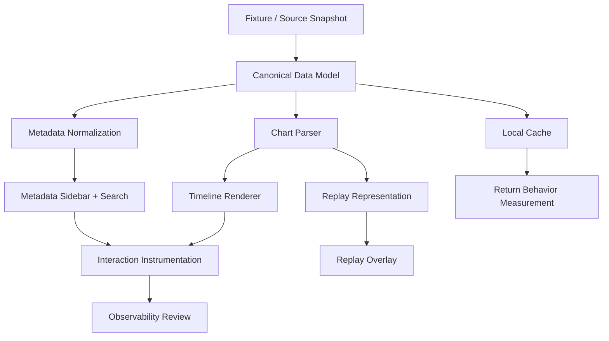

# Phase 0 / First Step Execution Plan

## 1. Mục Tiêu Tài Liệu

Tài liệu này trả lời một câu hỏi rất cụ thể: 3–6 tuần đầu tiên sẽ build cái gì, theo thứ tự nào, cái gì là foundation thật sự, cái gì phải fake/mock trước, cái gì chưa được build, và milestone nào dùng để kiểm chứng giả định.

Đây không phải là roadmap dài hạn.
Đây không phải là bản mô tả sản phẩm cuối cùng.
Đây là kế hoạch triển khai ban đầu cho Phase 0, với mục tiêu tạo ra một nền tảng đủ nhỏ để quan sát, đủ nghiêm túc để đo lường, và đủ chặt để ngăn scope creep.

Mọi quyết định ở đây phải phục vụ một nguyên tắc duy nhất:

Later phases depend on observations collected during the first deployment.

## 2. Vertical Slice Definition

Vertical slice đầu tiên phải là một đường thẳng dọc qua toàn bộ hệ thống cốt lõi, nhưng chỉ ở mức tối thiểu cần thiết để kiểm tra chuỗi giá trị thực.

### Slice 0: Một chart, một luồng, một vòng khép kín

Slice đầu tiên nên bao gồm:

- load một chart duy nhất từ nguồn đã chuẩn hóa
- parse chart thành canonical chart schema
- render timeline chart với lane, note, hold, và marker cơ bản
- hiển thị metadata sidebar tối thiểu
- ghi nhận interaction logging cơ bản
- lưu cache cục bộ cho entity vừa mở

Slice này cố tình chưa có replay, chưa có online sync, chưa có recommendation, và chưa có account.

### Slice 1: Chart + Metadata + Local Return

Slice thứ hai nên mở rộng thành:

- danh sách song/charts có search tối thiểu
- mở lại content vừa xem từ local cache
- chuyển giữa song detail và chart detail không mất ngữ cảnh
- instrument các hành vi mở lại, thoát sớm, và chuyển hướng

### Slice 2: Replay Inspection tối thiểu

Slice thứ ba chỉ nên xuất hiện khi chart slice đã ổn định.

Nó bao gồm:

- replay schema tối thiểu
- replay loading từ fixture hoặc sample data
- ghép replay với chart timeline
- hiển thị miss/timing marker cơ bản
- so sánh một replay với chart reference

### Slice Definition Rule

Một vertical slice chỉ được tính là hợp lệ nếu nó đi qua đủ 5 lớp:

1. ingest/fixture
2. canonical schema
3. derived normalized data
4. runtime view-model
5. rendering + instrumentation

Nếu thiếu một lớp trong 5 lớp này, slice vẫn còn là prototype rời rạc, chưa phải foundation thật sự.

## 3. Cái Gì Là Foundation Thật Sự

Foundation không phải là UI đẹp.
Foundation không phải là nhiều tính năng.
Foundation là những lớp mà toàn bộ các lớp khác phải phụ thuộc vào.

### 3.1 Canonical Data Model

Đây là foundation thật sự.

Không có canonical model thì parser sẽ drift, renderer sẽ drift, replay logic sẽ drift, metadata sẽ drift, và mọi thứ sau đó đều trở thành rework.

Canonical model phải được chốt sớm cho các thực thể sau:

- Song
- Chart
- Pack
- Asset
- Replay
- Entity relation
- Source provenance

### 3.2 Timeline and Rendering Contract

Timeline contract là foundation thứ hai.

Chart render, replay overlay, và interaction logging đều phải đọc từ cùng một timeline abstraction.
Nếu timeline không thống nhất, toàn bộ hệ thống sẽ có nhiều “sự thật” khác nhau.

### 3.3 Boundary Discipline

Foundation còn bao gồm ranh giới giữa:

- immutable source data
- normalized derived data
- cached data
- runtime view-model
- rendering-only state

Không có phân ranh này, state management sẽ nhanh chóng thành địa ngục.

### 3.4 Observability

Observability không phải phụ kiện.
Nó là một phần của foundation vì Phase 0 tồn tại để học từ hành vi thật.

## 4. Canonical Data Model

Canonical model phải được viết trước khi UI được mở rộng.
UI có thể mượn dữ liệu giả trong giai đoạn đầu, nhưng schema nền phải rõ.

### 4.1 Song Schema

Song là thực thể mẹ cho chart và metadata.

Trường tối thiểu:

- id
- title
- localized title aliases nếu có
- artist
- pack ids
- version/release grouping
- tags
- availability/provenance
- related asset refs

Song schema phải cho phép search, detail view, và cross-link nhưng không cần cố giải quyết mọi quan hệ ngay từ đầu.

### 4.2 Chart Schema

Chart là thực thể quan trọng nhất ở Phase 0.

Trường tối thiểu:

- id
- song id
- difficulty label
- chart type / side / mode nếu có
- bpm / timing reference
- note events
- hold events
- arc events
- flick / special note events
- source version
- parser version
- validation status

Chart schema phải đủ ổn định để render deterministic timeline và đủ rõ để debug parser.

### 4.3 Replay Schema

Replay không cần đầy đủ ngay, nhưng phải có khung chuẩn.

Trường tối thiểu:

- id
- chart id
- session timestamp
- input event stream
- timing offsets
- device / environment hints nếu có
- parse status
- provenance

Replay schema nên hỗ trợ inspection trước, comparison sau.

### 4.4 Pack Schema

Pack là lớp ngữ cảnh.

Trường tối thiểu:

- id
- name
- release order / version bucket
- related song ids
- related lore refs nếu có
- provenance

Pack schema không cần phức tạp, nhưng phải ổn định để navigation không bị rỗng nghĩa.

### 4.5 Asset Schema

Asset là lớp tham chiếu cho hình ảnh, thumbnail, icon, và các visual artifacts khác.

Trường tối thiểu:

- id
- type
- checksum
- storage location
- source ref
- license boundary flag
- display eligibility

### 4.6 Relation Schema

Quan hệ giữa entity cần có model riêng hoặc ít nhất là relation layer rõ ràng.

Không nên nhét mọi quan hệ vào JSON tùy tiện.

Quan hệ tối thiểu:

- song -> chart
- song -> pack
- song -> asset
- chart -> replay
- song/chart -> lore ref nếu có

### 4.7 Schema Rule

Schema phải ưu tiên:

- ổn định hơn là đầy đủ
- inspectable hơn là clever
- versioned hơn là ad hoc
- deterministic hơn là linh hoạt quá mức

## 5. System Boundary Mapping

Ranh giới hệ thống phải được chốt sớm để tránh đổ state bừa bãi.

### 5.1 Immutable Source Data

Đây là dữ liệu gốc đã được ingest hoặc fixture hóa.

Bao gồm:

- raw or semi-structured source records
- versioned source snapshots
- parser input
- fixture data dùng để test

Immutable source data không được mutate trong runtime UI.

### 5.2 Normalized Derived Data

Đây là dữ liệu đã qua chuẩn hóa để dùng trong app.

Bao gồm:

- canonical song objects
- canonical chart objects
- normalized pack/index records
- derived search documents
- replay parse results

Normalized data có thể regenerate từ nguồn gốc đã versioned.

### 5.3 Cached Data

Cached data là bản sao local được tối ưu cho truy cập lặp lại.

Bao gồm:

- recently opened entities
- offline browse subset
- chart rendering cache
- selected asset cache
- reusable derived lookup tables

Cached data có thể stale, nhưng phải biết mình stale ở đâu và vì sao.

### 5.4 Runtime View-Model

View-model là dữ liệu đã được shape lại cho component hoặc screen.

Bao gồm:

- chart screen model
- replay screen model
- metadata sidebar model
- search result model
- timeline control state

View-model không được trở thành source of truth.

### 5.5 Rendering-Only State

Đây là state tồn tại chỉ để vẽ.

Bao gồm:

- animation frame state
- camera or viewport state
- transient hover/focus state
- scrubber drag state
- highlight state

Rendering-only state phải disposable.
Không được để nó lẫn với dữ liệu canonical.

### 5.6 Boundary Rule

Nếu một lớp có thể regenerate từ lớp dưới nó, thì nó không được mutate lớp dưới đó.

## 6. Rendering Philosophy

Render model là một architectural fork lớn.
Phase 0 không được mơ hồ ở chỗ này.

### 6.1 Chọn Mô Hình Gì

Cho Phase 0, nên ưu tiên một renderer theo hướng 2D canvas-based hoặc engine 2D nhẹ kiểu PixiJS thay vì tự viết custom WebGL engine.

Lý do:

- nhanh để iterate
- đủ mạnh cho chart visualization và timeline playback
- ít overhead hơn việc tự xây engine
- dễ quan sát performance
- giảm nguy cơ khóa chặt architecture quá sớm

### 6.2 Không Chọn Gì Trong Phase 0

Chưa nên tự xây:

- custom GPU pipeline
- full WebGPU engine
- cinematic scene graph phức tạp
- multi-layer real-time compositor
- advanced shader ecosystem

Những thứ đó chỉ nên cân nhắc khi có bằng chứng rõ rằng chart/replay visualization cần tới.

### 6.3 Rendering Model

Rendering nên là timeline-based và lane-based.

Điều đó có nghĩa:

- một authoritative clock điều khiển toàn bộ chart state
- note objects được dựng từ chart time, không phải từ incremental UI mutation
- replay overlay đọc cùng clock với chart render
- frame state được tính lại từ thời gian chuẩn, không từ cảm giác animation tự phát

### 6.4 Deterministic Replay Clock

Replay clock phải deterministic trong phạm vi dữ liệu đầu vào đã biết.

Nếu cùng chart, cùng replay, cùng offset, cùng parser version thì phải cho ra cùng output.

### 6.5 Why This Matters

Nếu renderer không deterministic, các test snapshot và behavior observation đều bị nhiễu.
Nếu renderer quá phức tạp, team sẽ không biết vấn đề đến từ art, timing, or state.

## 7. Observability Spec

Observability phải được định nghĩa như một schema, không phải như một ý niệm chung chung.

### 7.1 Event Taxonomy

Tối thiểu phải có các nhóm event sau:

- session start
- route open
- entity open
- search submit
- search result click
- chart view open
- replay view open
- metadata sidebar interaction
- cache hit / cache miss
- offline fallback triggered
- parse validation error
- render performance warning
- user return event
- stale data refresh request

### 7.2 Session Model

Session model phải đủ để hiểu hành vi quay lại, nhưng không cần biến thành hệ thống account.

Tối thiểu:

- anonymous or local session id
- session start/end timestamp
- active route sequence
- content revisit sequence
- device or environment class if necessary

### 7.3 Interaction Logging

Logging nên ghi lại:

- cái gì được mở
- mở theo thứ tự nào
- người dùng ở lại bao lâu
- họ rời ở đâu
- họ quay lại với cái gì

Không cần ghi tất cả mọi thứ.
Chỉ cần ghi những thứ trả lời được câu hỏi nghiên cứu.

### 7.4 Privacy Boundary

Observability phải có ranh giới privacy rõ ràng.

Nguyên tắc:

- chỉ thu thập những gì cần cho nghiên cứu vận hành
- ưu tiên dữ liệu hành vi tổng quát hơn dữ liệu cá nhân
- không mặc định xây profile dài hạn nếu chưa cần
- tránh telemetry xâm lấn vô nghĩa

### 7.5 What Counts As Return Behavior

Return behavior phải được định nghĩa cụ thể.

Ví dụ các tín hiệu hữu ích:

- quay lại cùng một chart detail nhiều lần
- mở lại replay đã xem trước đó
- tìm kiếm cùng nhóm metadata ở nhiều phiên khác nhau
- đi từ song detail sang pack/lore rồi quay về chart
- sử dụng offline cache sau lần xem đầu

Return behavior không nên được đo bằng số lần vào app đơn thuần.

### 7.6 Why Observability Is Part of Foundation

Không có observability, Phase 0 không thể học được gì đáng tin.
Cho nên observability là một phần của foundation, không phải lớp trang trí sau cùng.

## 8. What Not To Build Yet

Đây là các hard constraints của Phase 0.
Chúng không phải gợi ý.
Chúng là giới hạn thiết kế.

### 8.1 Forbidden Systems in Phase 0

- user accounts
- websocket infrastructure
- ranking systems
- recommendation systems
- server authority as default
- collaborative editing
- plugin systems
- creator marketplace behavior
- social feed mechanics
- multiplayer or live interaction systems
- broad cloud sync
- ML-based inference systems
- public platform APIs

### 8.2 Why These Are Forbidden

Chúng bị cấm trong Phase 0 vì mỗi hệ thống trong danh sách này sẽ:

- tăng chi phí vận hành
- làm méo tín hiệu quan sát
- kéo theo bài toán identity và moderation
- ép kiến trúc đi trước bằng giả định chưa được kiểm chứng
- tạo cảm giác dự án “đã lớn” trong khi chưa có evidence

### 8.3 Mock Instead Of Build

Các phần sau nên được fake/mock trước khi build thật:

- replay sample data
- asset thumbnails
- pack grouping nếu data nguồn chưa ổn
- event markers trong chart nếu cần demo
- metadata provenance labels nếu nguồn chưa hoàn chỉnh
- offline content subset

Mock là hợp lý khi mục tiêu là kiểm tra UI flow hoặc observation flow.
Mock là sai khi được dùng để thay thế foundation dữ liệu thật quá lâu.

### 8.4 What Must Stay Undecided

Trong Phase 0, các vấn đề sau phải được để mở:

- cuối cùng renderer là Canvas2D hay PixiJS hay một lựa chọn khác
- replay analysis sẽ dừng ở mức nào
- community surfaces nào thật sự đáng làm
- có cần cloud sync hay không
- recommendation logic có giá trị thực hay chỉ là nhiễu
- dữ liệu nào nên public, dữ liệu nào chỉ nên local

## 9. Execution Order

Đây là dependency graph thực tế. Nếu đảo thứ tự này, dự án sẽ bắt đầu build trên nền cát.

### 9.1 Dependency Graph

### 9.2 Build Order

The correct order for the first 3–6 weeks is:

1. canonical data model
2. fixture/source snapshot selection
3. chart parser
4. metadata normalization
5. minimal renderer and timeline contract
6. local cache and persistence
7. interaction instrumentation
8. chart detail vertical slice
9. search/navigation skeleton
10. replay representation only after chart slice stabilizes

### 9.3 Why This Order

This order reduces rework because each layer is validated by the layer above it.
If the renderer comes before the schema, the renderer will guess.
If observability comes too late, behavior will already have been distorted.
If replay is built before chart stability, the replay work will sit on an unstable target.

## 10. 3–6 Tuần Đầu Tiên Sẽ Build Cái Gì

Mục tiêu của giai đoạn này là tạo ra một chart-first, observation-first foundation.
Không phải một sản phẩm hoàn chỉnh.
Không phải một hệ sinh thái đầy đủ.

### Tuần 1: Foundation Setup và Data Shape

Mục tiêu:

- chốt canonical data model cho Song, Chart, Pack, Asset
- chọn một data snapshot hoặc fixture nhỏ, ổn định, có provenance
- xác định ranh giới giữa source data, normalized data, cached data, view-model, rendering state
- thiết lập logging/telemetry schema tối thiểu

Việc cần làm:

- tạo schema types
- tạo fixture content tối thiểu
- dựng validation rules
- dựng basic ingestion/normalization pass

Chưa được làm:

- replay viewer
- account systems
- recommendation systems
- cloud sync
- social systems

Milestone kiểm chứng:

- một chart sample có thể đi từ fixture sang normalized model mà không mất provenance
- schema đủ rõ để các lớp khác bắt đầu phụ thuộc vào nó

### Tuần 2: Chart Parser và Timeline Contract

Mục tiêu:

- parse chart thành canonical chart model
- định nghĩa timeline contract
- dựng note/hold/arc object representation tối thiểu
- render được 1 chart duy nhất end-to-end

Việc cần làm:

- parser validation
- timeline abstraction
- frame state derivation
- minimal chart scene render

Fake/mock trước:

- asset thumbnails
- secondary metadata fields
- locale variants nếu chưa có nguồn ổn định

Milestone kiểm chứng:

- chart render ổn định qua nhiều lần reload
- parser output deterministic
- timeline state không bị phụ thuộc vào UI mutation

### Tuần 3: Metadata Navigation và Local Cache

Mục tiêu:

- dựng metadata sidebar và song detail tối thiểu
- cho phép search/browse trong phạm vi rất hẹp
- thêm local persistence cho recently opened entities
- instrument route open / close / revisit

Việc cần làm:

- search index tối thiểu
- metadata relation lookup
- local cache store
- return behavior logging

Chưa được làm:

- ranking
- social feed
- account
- sync
- advanced analytics

Milestone kiểm chứng:

- người dùng có thể mở chart, đi sang song detail, quay lại chart mà không mất ngữ cảnh
- local cache thực sự giảm chi phí mở lại
- route pattern đủ rõ để phân biệt exploration với one-off lookup

### Tuần 4: Replay Representation Mức Tối Thiểu

Mục tiêu:

- thiết kế replay schema tối thiểu
- load replay từ fixture/sample
- ghép replay với timeline chart
- render miss/timing marker cơ bản

Việc cần làm:

- replay schema
- replay parser stub hoặc adapter
- overlay state
- comparison anchor points

Fake/mock trước:

- replay data phong phú
- advanced scoring
- ghost systems phức tạp

Milestone kiểm chứng:

- replay có thể được mở và đọc như một object có cấu trúc
- marker timing hiển thị nhất quán
- người dùng hiểu được replay đang nói về điều gì

### Tuần 5: Observability Review và Friction Audit

Mục tiêu:

- xem lại dữ liệu logging đã thu
- xác định nơi người dùng dừng lại, quay lại, hoặc bỏ cuộc
- audit những màn hình gây hiểu nhầm
- đo maintenance cost ban đầu

Việc cần làm:

- review event taxonomy
- check session flow
- detect stale/missing data paths
- profile runtime cost của rendering và parsing

Milestone kiểm chứng:

- biết user đang dùng platform như wiki, analysis tool, hay practice tool
- biết bước nào gây friction mạnh nhất
- biết subsystem nào bắt đầu tốn công bảo trì nhất

### Tuần 6: Decide or Stop

Mục tiêu:

- tổng hợp evidence
- xác định phần nào nên mở rộng, phần nào nên giữ nguyên, phần nào nên bỏ
- quyết định có đủ cơ sở để sang phase tiếp theo hay chưa

Việc cần làm:

- evaluate return behavior
- compare repeated routes
- review data freshness and ingestion burden
- assess whether the current foundation survived real usage

Milestone kiểm chứng:

- có đủ evidence để trả lời “có đáng mở rộng không”
- biết rõ hệ thống nào đáng giữ
- biết rõ giả định nào sai

## 11. Milestone Kiểm Chứng

Các milestone không nên là danh sách tính năng.
Chúng phải là bằng chứng rằng foundation đang học được điều gì đó.

### Milestone A: Canonical Model Holds

Tiêu chí:

- schema không vỡ khi ingest dữ liệu thật đầu tiên
- parser và normalized model khớp nhau
- provenance còn đọc được

### Milestone B: One Chart, One Truth

Tiêu chí:

- chart render nhất quán qua reload
- timeline contract không mâu thuẫn
- note state và render state tách bạch

### Milestone C: Meaningful Navigation

Tiêu chí:

- người dùng đi từ chart sang metadata rồi quay lại
- search và detail flow đủ rõ để lặp lại
- local cache hỗ trợ revisit

### Milestone D: Replay Is Legible

Tiêu chí:

- replay representation không phải dữ liệu rỗng
- marker cơ bản đọc được
- replay tăng hiểu biết thay vì chỉ làm cho có

### Milestone E: Observability Produces Insight

Tiêu chí:

- log cho thấy người dùng mở gì, bỏ gì, quay lại gì
- metrics giúp phân biệt novelty với real return behavior
- team có thể nói cái gì đang hoạt động và cái gì không

### Milestone F: Maintenance Burden Is Still Realistic

Tiêu chí:

- cập nhật dữ liệu không đòi quá nhiều thao tác thủ công
- debugging không cần truy ngược qua quá nhiều lớp trừu tượng
- hệ thống không phụ thuộc vào những phần chưa chứng minh được giá trị

## 12. Kết Luận Vận Hành

Phase 0 chỉ thành công nếu nó giữ được sự kỷ luật.
Nó phải đủ nhỏ để học, đủ rõ để đo, và đủ thật để không tự lừa mình.

Nếu sau 3–6 tuần đầu tiên, foundation cho thấy chart exploration là trung tâm, thì hệ thống tương lai nên nghiêng về chart.
Nếu replay trở thành điểm quay lại mạnh nhất, thì replay mới xứng đáng được mở rộng.
Nếu metadata navigation và lore context là thứ giữ người dùng ở lại, thì kiến trúc tiếp theo phải phản ánh điều đó.
Nếu cộng đồng chỉ phản hồi tốt với curated companion surfaces, thì social hóa rộng là sai hướng.

Đó là mục đích của bản execution này:
không phải xây xong tương lai,
mà là tạo ra điều kiện để tương lai phải chứng minh rằng nó xứng đáng tồn tại.
